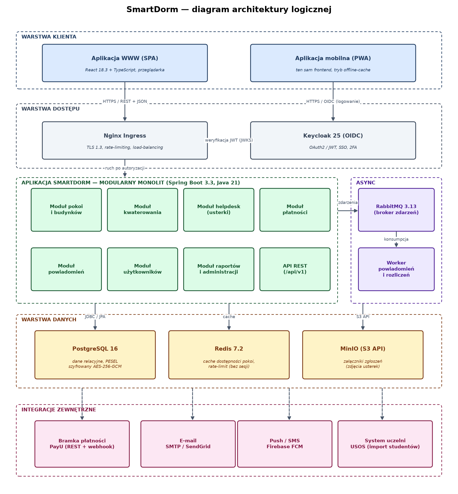
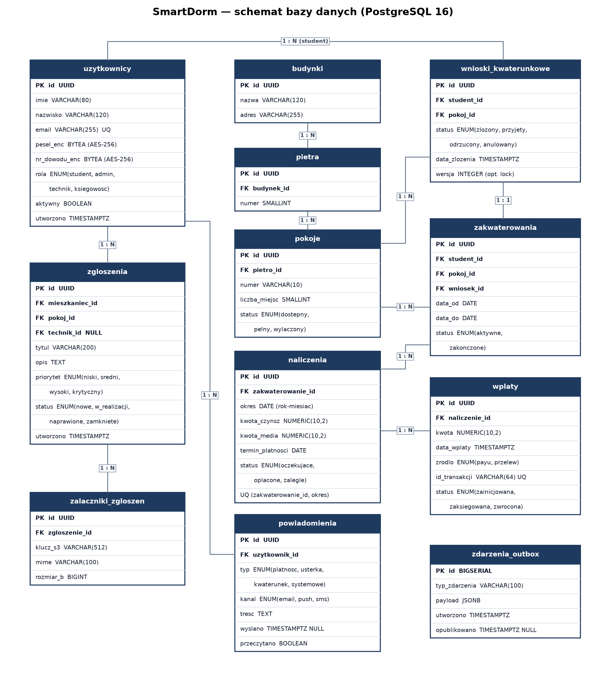

# 1. Wprowadzenie

## 1.1. Cel dokumentu

Niniejszy dokument stanowi projekt techniczny systemu informatycznego **SmartDorm** — platformy automatyzującej procesy kwaterowania, naliczania opłat oraz obsługi zgłoszeń usterek w akademiku. Dokument opisuje przyjęty model architektoniczny wraz z uzasadnieniem, podział systemu na komponenty, konkretny stos technologiczny, infrastrukturę wdrożeniową, strategię przechowywania danych, sposób migracji i inicjalizacji bazy, specyfikację API, model komunikacji międzykomponentowej, integracje z systemami zewnętrznymi, zarządzanie stanem i błędami oraz mechanizmy uwierzytelniania i autoryzacji. Załącznikami do dokumentu są diagram architektury logicznej systemu (Załącznik A) oraz schemat bazy danych (Załącznik B).

## 1.2. Zakres funkcjonalny systemu

Zgodnie z wymaganiami system realizuje pięć głównych obszarów funkcjonalnych:

- **Zarządzanie pokojami** — administrator definiuje strukturę budynku: piętra, numery pokoi oraz liczbę miejsc w każdym pokoju.
- **Proces kwaterowania** — student po zalogowaniu składa wniosek o zakwaterowanie w konkretnym pokoju; system prezentuje dostępność miejsc w czasie rzeczywistym i chroni przed podwójną rezerwacją tego samego miejsca.
- **System zgłoszeń (helpdesk)** — mieszkaniec zgłasza usterkę (np. „zepsuty kran"), załącza zdjęcia i śledzi status naprawy od momentu przyjęcia zgłoszenia do jego zamknięcia.
- **Moduł płatności** — system generuje comiesięczne naliczenia za czynsz i media, a student ma wgląd w historię swoich wpłat i saldo konta.
- **Powiadomienia** — system informuje użytkowników o zbliżających się terminach płatności oraz o zmianach statusu zgłoszonych usterek.

## 1.3. Wymagania niefunkcjonalne

Kluczowe parametry jakościowe, które zdeterminowały decyzje projektowe:

- **Dostępność** — dostęp przez przeglądarkę internetową oraz urządzenia mobilne (podejście responsive + PWA).
- **Bezpieczeństwo** — dane osobowe studentów (PESEL, numer dowodu) muszą być szyfrowane w bazie danych; całość komunikacji odbywa się po TLS.
- **Wydajność** — system musi obsłużyć nagły skok ruchu rzędu 500 logowań w ciągu 5 minut w dniu otwarcia zapisów na pokoje, bez degradacji czasu odpowiedzi poniżej akceptowalnego poziomu (95. percentyl < 800 ms dla operacji odczytu).

# 2. Model architektoniczny

## 2.1. Analiza wariantów

Rozważono trzy warianty architektoniczne:

| Kryterium | Monolit klasyczny | Modularny monolit | Mikroserwisy |
|---|---|---|---|
| Złożoność wdrożenia | niska | niska | wysoka |
| Koszt utrzymania | niski | niski | wysoki |
| Skalowalność | ograniczona | dobra (horyzontalna) | bardzo dobra |
| Spójność transakcyjna | pełna (ACID) | pełna (ACID) | trudna (sagi) |
| Ryzyko „big ball of mud" | wysokie | niskie | niskie |
| Zespół potrzebny do utrzymania | 1–2 os. | 1–2 os. | 4+ os. |

Pełna architektura mikroserwisowa została odrzucona jako nieproporcjonalna do skali problemu: system obsługuje jeden akademik (docelowo kilka tysięcy użytkowników), a rozproszenie danych między serwisy skomplikowałoby transakcyjność kluczowego procesu kwaterowania (rezerwacja miejsca musi być atomowa). Z kolei klasyczny, niepodzielony monolit rodzi ryzyko splątania kodu w miarę rozwoju systemu.

## 2.2. Wybrany wariant: modularny monolit z asynchronicznymi workerami

Przyjęto architekturę **modularnego monolitu** (ang. modular monolith) opartą na architekturze warstwowej, z wydzielonym **asynchronicznym workerem** do zadań w tle. Oznacza to jeden wdrażalny artefakt aplikacyjny, wewnętrznie podzielony na moduły domenowe o jawnie zdefiniowanych granicach (osobne pakiety, komunikacja wyłącznie przez interfejsy publiczne modułów, egzekwowana narzędziem ArchUnit). Wewnątrz każdego modułu obowiązuje klasyczny podział warstwowy:

1. **Warstwa prezentacji (API)** — kontrolery REST, walidacja wejścia, mapowanie DTO.
2. **Warstwa aplikacji** — usługi realizujące przypadki użycia, granice transakcji.
3. **Warstwa domeny** — encje, reguły biznesowe (np. reguła „liczba zakwaterowanych ≤ liczba miejsc").
4. **Warstwa infrastruktury** — repozytoria JPA, klienci integracji zewnętrznych, publikacja zdarzeń.

Zalety tego podejścia w kontekście SmartDorm:

- proces kwaterowania korzysta z pełnych transakcji ACID w jednej bazie danych, co eliminuje problem podwójnych rezerwacji bez skomplikowanych protokołów rozproszonych;
- aplikacja jest bezstanowa (kontekst żądania niesie token JWT, brak sesji serwletowych; Redis przechowuje wyłącznie stan współdzielony — cache i liczniki rate-limitera), więc skaluje się horyzontalnie — na dzień otwarcia zapisów wystarczy zwiększyć liczbę replik;
- granice modułów pokrywają się z potencjalnymi przyszłymi mikroserwisami — jeżeli system urośnie (np. obsługa wielu akademików w wielu miastach), moduł płatności lub helpdesk można wydzielić bez przepisywania logiki.

Zadania niewymagające synchronicznej odpowiedzi (wysyłka powiadomień, comiesięczne naliczanie opłat, przetwarzanie webhooków płatności) są realizowane przez osobny proces workera konsumujący zdarzenia z kolejki komunikatów, co odciąża ścieżkę obsługi żądań HTTP.

# 3. Diagram komponentów i podział na moduły

Graficzne ujęcie architektury zawiera Załącznik A. System dzieli się na następujące główne komponenty techniczne:

## 3.1. Komponenty frontendowe

- **Aplikacja WWW (SPA)** — aplikacja jednostronicowa w React, serwowana jako statyczne pliki z Nginx; realizuje panele studenta, technika i administratora.
- **Aplikacja mobilna (PWA)** — ten sam kod frontendowy opakowany jako Progressive Web App (manifest, service worker, cache offline dla widoków odczytu), co spełnia wymóg dostępności na urządzeniach mobilnych bez utrzymywania osobnych aplikacji natywnych.

## 3.2. Komponenty backendowe (moduły monolitu)

| Moduł | Odpowiedzialność | Zależności wewnętrzne |
|---|---|---|
| Pokoje i budynki | struktura budynku: piętra, pokoje, liczba miejsc, status pokoju | — |
| Kwaterowanie | wnioski, rezerwacja miejsc, dostępność w czasie rzeczywistym | Pokoje, Użytkownicy |
| Helpdesk | zgłoszenia usterek, załączniki, przepływ statusów, przydział technika | Użytkownicy, Pokoje |
| Płatności | naliczenia miesięczne, księgowanie wpłat, saldo, historia | Kwaterowanie |
| Powiadomienia | szablony wiadomości, wybór kanału, rejestr doręczeń | Użytkownicy |
| Użytkownicy | profil, role, synchronizacja z Keycloak i USOS | — |
| Raporty i administracja | obłożenie, zaległości, eksporty CSV | wszystkie (tylko odczyt) |

## 3.3. Komponenty infrastrukturalne

- **Nginx Ingress** — punkt wejścia: terminacja TLS, load-balancing, limitowanie liczby żądań.
- **Keycloak** — zewnętrzny (względem monolitu) serwer tożsamości: logowanie, wydawanie tokenów, role.
- **RabbitMQ** — broker komunikatów dla zdarzeń domenowych.
- **Worker powiadomień i rozliczeń** — drugi artefakt wdrożeniowy (ten sam kod źródłowy, inny profil uruchomieniowy) konsumujący kolejki.
- **PostgreSQL, Redis, MinIO** — warstwa danych (opisana w rozdziale 6).

# 4. Stos technologiczny

Przyjęto następujące, konkretne wersje technologii (stan na moment projektowania; strategia aktualizacji: wersje LTS, podbicia minor co kwartał):

| Obszar | Technologia | Wersja | Rola |
|---|---|---|---|
| Język backendu | Java (LTS) | 21.0.4 | logika serwerowa |
| Framework backendu | Spring Boot | 3.3.4 | REST, DI, bezpieczeństwo |
| Serwer aplikacyjny | Tomcat (embedded) | 10.1.28 | kontener servletów w artefakcie |
| ORM / dostęp do danych | Hibernate / Spring Data JPA | 6.5.3 / 3.3.4 | mapowanie obiektowo-relacyjne |
| Migracje bazy | Flyway | 10.17.0 | wersjonowanie schematu |
| Język frontendu | TypeScript | 5.5.4 | typowany kod kliencki |
| Framework frontendu | React | 18.3.1 | SPA / PWA |
| Budowanie frontendu | Vite | 5.4.8 | bundling, dev-server |
| Baza danych | PostgreSQL | 16.4 | dane relacyjne |
| Cache / stan współdzielony | Redis | 7.2.5 | cache dostępności, rate-limit |
| Broker komunikatów | RabbitMQ | 3.13.7 | zdarzenia asynchroniczne |
| Storage obiektowy | MinIO (S3 API) | RELEASE.2024-09-22 | załączniki zgłoszeń |
| Serwer tożsamości | Keycloak | 25.0.5 | OAuth2 / OIDC / RBAC |
| Reverse proxy | Nginx | 1.26.2 | TLS, LB, rate-limiting |
| Odporność integracji | Resilience4j | 2.2.0 | retry, circuit breaker |
| Monitoring | Prometheus + Grafana | 2.53.2 / 11.2.0 | metryki, dashboardy |
| Śledzenie błędów | Sentry (self-hosted) | 24.9.0 | agregacja wyjątków |

Uzasadnienie kluczowych wyborów: Java 21 z wirtualnymi wątkami (Project Loom) pozwala obsłużyć dużą liczbę równoległych żądań I/O-bound (szczyt logowań) bez przechodzenia na programowanie reaktywne; PostgreSQL 16 zapewnia transakcyjność oraz blokady wierszowe potrzebne przy rezerwacji miejsc, a szyfrowanie danych osobowych realizowane jest na poziomie aplikacji (AES-256-GCM, zob. rozdz. 12.3) — dzięki czemu klucze nigdy nie trafiają do bazy; React + PWA realizuje wymóg dostępności mobilnej jednym kodem.

# 5. Infrastruktura wdrożeniowa

## 5.1. Konteneryzacja i orkiestracja

Wszystkie komponenty są konteneryzowane (**Docker 26**, obrazy budowane wieloetapowo: etap budowania Maven/Vite, etap uruchomieniowy na `eclipse-temurin:21-jre-alpine`). Orkiestrację zapewnia **Kubernetes 1.30** w wariancie zarządzanym u dostawcy chmurowego (klaster w regionie UE ze względu na RODO; projekt jest agnostyczny względem dostawcy — wymagane są jedynie usługi: managed Kubernetes, managed PostgreSQL, storage klasy S3).

Struktura wdrożenia w klastrze:

- **Deployment `smartdorm-api`** — bezstanowa aplikacja główna; bazowo 2 repliki, HPA (Horizontal Pod Autoscaler) skalujący do 8 replik przy CPU > 70% lub > 150 żądaniach/s na pod.
- **Deployment `smartdorm-worker`** — 2 repliki konsumenta kolejek (skalowanie po długości kolejki, KEDA).
- **StatefulSet / usługi zarządzane** — PostgreSQL jako usługa zarządzana z repliką odczytu i automatycznym failoverem; Redis i RabbitMQ jako StatefulSety z persystencją; MinIO w trybie rozproszonym (4 węzły) lub zamiennie bucket S3 dostawcy.
- **Ingress-Nginx** — TLS 1.3 (certyfikaty Let's Encrypt odnawiane przez cert-manager), limit 20 żądań/s na adres IP dla endpointów logowania.

## 5.2. Środowiska i CI/CD

Utrzymywane są trzy środowiska: **dev** (jednowęzłowy klaster, dane syntetyczne), **staging** (kopia produkcji, anonimizowane dane) i **produkcja**. Potok CI/CD (GitHub Actions):

1. build + testy jednostkowe i integracyjne (Testcontainers z PostgreSQL i RabbitMQ),
2. analiza statyczna (SonarQube, skan zależności OWASP Dependency-Check, skan obrazów Trivy),
3. publikacja obrazu do rejestru z tagiem SHA,
4. wdrożenie na staging (Argo CD, model GitOps) + testy dymne,
5. ręczna promocja na produkcję (strategia rolling update, możliwość natychmiastowego rollbacku do poprzedniej rewizji).

## 5.3. Obsługa szczytu ruchu (500 logowań / 5 minut)

Szczyt zapisów obsługiwany jest przez: (a) prealokację replik — w dniu otwarcia zapisów minimalna liczba replik API podnoszona jest planowo do 6; (b) cache dostępności pokoi w Redis (odczyty nie obciążają PostgreSQL); (c) kolejkowanie operacji zapisu wniosków przy przeciążeniu (backpressure z limitem czasu); (d) rate-limiting na Ingress chroniący przed nadmiarowym odpytywaniem. Logowanie realizuje Keycloak w osobnym podzie (2 repliki), więc szczyt uwierzytelnień nie konkuruje o zasoby z logiką biznesową.

# 6. Strategia przechowywania danych

## 6.1. Dane relacyjne — PostgreSQL

Głównym magazynem danych jest PostgreSQL 16. Schemat (Załącznik B) obejmuje m.in. tabele: `uzytkownicy`, `budynki`, `pietra`, `pokoje`, `wnioski_kwaterunkowe`, `zakwaterowania`, `zgloszenia`, `zalaczniki_zgloszen`, `naliczenia`, `wplaty`, `powiadomienia` oraz `zdarzenia_outbox`. Kluczowe decyzje:

- **Klucze główne UUID v7** — bezpieczne w URL-ach API (brak enumeracji zasobów), a zarazem quasi-sekwencyjne (przyjazne dla indeksów B-tree).
- **Szyfrowanie danych wrażliwych** — kolumny `pesel_enc` i `nr_dowodu_enc` przechowują szyfrogram AES-256-GCM; szczegóły w rozdziale 12.3.
- **Integralność procesu kwaterowania** — ograniczenie unikalności `UQ (zakwaterowanie_id, okres)` w naliczeniach zapobiega podwójnemu naliczeniu za ten sam miesiąc, a kontrola pojemności pokoju odbywa się w transakcji z blokadą `SELECT ... FOR UPDATE` na wierszu pokoju.
- **Indeksy** — m.in. częściowy indeks na `zakwaterowania(pokoj_id) WHERE status = 'aktywne'` (szybkie liczenie wolnych miejsc) oraz indeks na `naliczenia(status, termin_platnosci)` (wyszukiwanie zaległości przez worker powiadomień).

## 6.2. Pliki — storage obiektowy

Załączniki zgłoszeń (zdjęcia usterek, do 10 MB, formaty JPEG/PNG/HEIC) nie trafiają do bazy relacyjnej, lecz do **storage obiektowego zgodnego z S3 (MinIO)**. W bazie przechowywany jest wyłącznie klucz obiektu i metadane (`zalaczniki_zgloszen`). Wysyłka odbywa się bezpośrednio z przeglądarki przez **pre-signed URL** (ważny 15 minut), dzięki czemu duże pliki nie przechodzą przez aplikację. Pobieranie analogicznie — API generuje pre-signed URL tylko dla uprawnionych użytkowników. Obiekty są wersjonowane, a cykl życia usuwa załączniki zgłoszeń zamkniętych po 24 miesiącach.

## 6.3. Cache i dane ulotne — Redis

Redis 7.2 pełni trzy role: (1) **cache dostępności pokoi** — mapa „pokój → liczba wolnych miejsc" odświeżana zdarzeniami domenowymi, z TTL 30 s jako zabezpieczeniem przed dryfem; (2) **magazyn stanu ratelimitera** i krótkotrwałych blokad idempotencyjnych; (3) **cache danych słownikowych i treści UI** (np. ogłoszenia administracji). Redis nie przechowuje sesji użytkowników — uwierzytelnienie jest bezstanowe (JWT), więc żaden ze stanów w Redis nie jest wymagany do obsłużenia pojedynczego żądania. Cache jest wyłącznie optymalizacją — źródłem prawdy zawsze pozostaje PostgreSQL, a operacja rezerwacji miejsca nigdy nie ufa wartości z cache.

## 6.4. Kopie zapasowe i retencja

PostgreSQL: ciągła archiwizacja WAL + pełny zrzut nocny; RPO 5 minut, RTO 1 godzina; kopie szyfrowane i replikowane do drugiego regionu; test odtwarzania raz na kwartał. MinIO: replikacja między strefami. Dane osobowe studentów po wygaśnięciu umowy zakwaterowania są po 5 latach anonimizowane (wymóg retencyjny rozliczeń), co realizuje cykliczne zadanie workera.

# 7. Migracja i inicjalizacja danych

## 7.1. Wersjonowanie schematu

Schemat bazy jest w całości zarządzany przez **Flyway** — każdy przyrost to niemodyfikowalny skrypt `V<nr>__opis.sql` w repozytorium, wykonywany automatycznie przy starcie aplikacji (na produkcji: w osobnym kroku potoku wdrożeniowego, przed podmianą wersji). Obowiązuje zasada zgodności wstecznej o jedną wersję (expand–contract): najpierw dodajemy nowe kolumny/tabele, wdrażamy kod czytający oba warianty, dopiero po pełnym wdrożeniu usuwamy stare struktury. Umożliwia to wdrożenia rolling bez okna serwisowego.

## 7.2. Zasilenie początkowe

Inicjalizacja nowej instancji przebiega w trzech krokach:

1. **Migracje strukturalne** — Flyway tworzy pełny schemat wraz ze słownikami (statusy, priorytety, typy powiadomień jako typy ENUM).
2. **Import struktury budynku** — administrator wgrywa plik CSV (piętro, numer pokoju, liczba miejsc) przez dedykowany endpoint `POST /api/v1/admin/import/pokoje`; import jest transakcyjny, walidowany (duplikaty numerów, wartości ujemne) i idempotentny — ponowne wgranie tego samego pliku nie tworzy duplikatów (upsert po kluczu naturalnym budynek+numer).
3. **Import użytkowników** — konta studentów są zakładane na podstawie eksportu z systemu uczelni USOS (rozdział 10.4); pierwsze hasło ustawiane jest linkiem aktywacyjnym, system nigdy nie przechowuje haseł tymczasowych.

Środowiska dev/staging otrzymują dodatkowo dane syntetyczne (generator: 2 budynki, 400 pokoi, 1000 studentów, historia 12 miesięcy naliczeń) uruchamiany wyłącznie poza produkcją (profil aplikacji `seed`).

# 8. Specyfikacja API

## 8.1. Protokół i konwencje

Interfejs publiczny to **REST po HTTPS z JSON** (UTF-8), opisany kontraktem **OpenAPI 3.1** (kontrakt generowany z kodu i publikowany jako Swagger UI na środowiskach nieprodukcyjnych). Wybrano REST zamiast GraphQL/gRPC, ponieważ: klientami są wyłącznie własne aplikacje o przewidywalnych widokach danych, REST ma najniższy próg wejścia i najlepsze wsparcie cache/narzędzi, a gRPC nie jest naturalny dla przeglądarki. Konwencje:

- wersjonowanie w ścieżce: `/api/v1/...`; zmiany łamiące wyłącznie w nowej wersji;
- rzeczowniki w liczbie mnogiej, identyfikatory UUID: `/api/v1/zgloszenia/{id}`;
- paginacja kursorowa (`?cursor=...&limit=50`), filtrowanie parametrami zapytania;
- pola JSON w `camelCase`, daty w ISO 8601 (UTC);
- nagłówek `Idempotency-Key` wymagany dla operacji tworzących płatności i wnioski.

## 8.2. Kluczowe endpointy

| Metoda i ścieżka | Opis | Role |
|---|---|---|
| GET /api/v1/pokoje?status=dostepny | lista pokoi z liczbą wolnych miejsc (czas rzeczywisty) | student, admin |
| POST /api/v1/wnioski | złożenie wniosku o zakwaterowanie w pokoju | student |
| PATCH /api/v1/wnioski/{id} | decyzja: przyjęcie / odrzucenie wniosku | admin |
| GET /api/v1/moje/zakwaterowanie | bieżące zakwaterowanie studenta | student |
| POST /api/v1/zgloszenia | zgłoszenie usterki (z referencjami załączników) | student |
| POST /api/v1/zgloszenia/{id}/zalaczniki | wydanie pre-signed URL do wysyłki zdjęcia | student |
| PATCH /api/v1/zgloszenia/{id}/status | zmiana statusu naprawy | technik, admin |
| GET /api/v1/moje/naliczenia | naliczenia i saldo studenta | student |
| POST /api/v1/platnosci | inicjacja płatności online (przekierowanie do PayU) | student |
| POST /api/v1/webhooks/payu | webhook potwierdzenia płatności (podpisany) | system |
| POST /api/v1/admin/import/pokoje | import struktury budynku z CSV | admin |
| GET /api/v1/admin/raporty/obłozenie | raport obłożenia budynku | admin |

## 8.3. Format błędów

Błędy zwracane są w formacie **RFC 9457 (Problem Details for HTTP APIs)** — `application/problem+json` z polami `type`, `title`, `status`, `detail`, `traceId` oraz, dla błędów walidacji (422), tablicą `errors[{field, code, message}]`. Kody: 400 (składnia), 401 (brak/nieważny token), 403 (brak uprawnień), 404 (zasób nie istnieje lub nie należy do użytkownika), 409 (konflikt biznesowy, np. brak wolnych miejsc), 422 (walidacja), 429 (rate-limit, z nagłówkiem `Retry-After`), 5xx (błędy serwera — bez ujawniania szczegółów wewnętrznych).

# 9. Komunikacja międzykomponentowa

## 9.1. Komunikacja synchroniczna

Ścieżka żądania użytkownika jest w pełni synchroniczna: klient → Nginx → API (REST). Wewnątrz monolitu moduły komunikują się przez wywołania metod interfejsów publicznych (w jednej transakcji bazodanowej tam, gdzie wymaga tego spójność — np. przyjęcie wniosku tworzy zakwaterowanie i aktualizuje status pokoju atomowo). Synchronicznie realizowane są wyłącznie operacje, których wynik użytkownik musi znać natychmiast.

## 9.2. Komunikacja asynchroniczna — zdarzenia domenowe

Wszystkie skutki uboczne przeniesiono do modelu **publikuj–subskrybuj** na RabbitMQ (exchange typu topic `smartdorm.events`). Główne zdarzenia:

| Zdarzenie | Producent | Konsument | Skutek |
|---|---|---|---|
| wniosek.przyjety | Kwaterowanie | Powiadomienia | e-mail/push do studenta |
| zgloszenie.status.zmieniony | Helpdesk | Powiadomienia | powiadomienie mieszkańca |
| naliczenie.utworzone | Płatności (worker) | Powiadomienia | informacja o kwocie i terminie |
| naliczenie.termin.zbliza_sie | Płatności (harmonogram) | Powiadomienia | przypomnienie T-3 dni |
| wplata.zaksiegowana | Płatności | Powiadomienia, Raporty | potwierdzenie, aktualizacja salda |
| zakwaterowanie.zakonczone | Kwaterowanie | Płatności | zamknięcie naliczeń |

Publikacja zdarzeń używa wzorca **transactional outbox**: zdarzenie zapisywane jest w tabeli `zdarzenia_outbox` w tej samej transakcji co zmiana biznesowa, a osobny relay publikuje je do RabbitMQ i oznacza jako opublikowane. Gwarantuje to, że żadne zdarzenie nie zginie ani nie zostanie wyemitowane dla wycofanej transakcji. Konsumenci są **idempotentni** (deduplikacja po identyfikatorze zdarzenia), ponieważ obowiązuje semantyka dostarczenia at-least-once. Kolejki mają skonfigurowane DLQ (dead letter queue) — komunikat po 5 nieudanych próbach (z wykładniczym odstępem) trafia do kolejki martwej i generuje alert.

# 10. Integracje zewnętrzne

## 10.1. Bramka płatności (PayU)

Płatności online realizuje PayU (REST API v2.1). Przepływ: API tworzy zamówienie (`POST /orders`, z `extOrderId` = UUID naliczenia — idempotencja po stronie bramki), student jest przekierowywany na stronę płatności, a potwierdzenie wraca **podpisanym webhookiem** na `POST /api/v1/webhooks/payu`. Weryfikowana jest sygnatura (HMAC z kluczem sklepu), kwota i waluta; webhook jest przetwarzany idempotentnie (unikalny `id_transakcji` w tabeli `wplaty`). Uzupełniająco worker cyklicznie odpytuje status transakcji zainicjowanych, dla których webhook nie dotarł w 30 minut. Przelewy tradycyjne księguje ręcznie rola księgowości.

## 10.2. E-mail

Wysyłka e-maili przez SMTP z relayem SendGrid (API key, TLS). Szablony wiadomości (Thymeleaf) wersjonowane w repozytorium. Obsługiwane są zwrotki (bounce) — po dwóch twardych zwrotkach adres jest oznaczany jako niedostarczalny i administrator otrzymuje raport.

## 10.3. Powiadomienia push i SMS

Powiadomienia push do PWA realizuje **Firebase Cloud Messaging** (Web Push); tokeny urządzeń przechowywane per użytkownik, unieważniane przy wylogowaniu. SMS (opcjonalny kanał dla krytycznych powiadomień o zaległościach) — bramka SMSAPI po REST. Wybór kanałów per typ powiadomienia konfiguruje użytkownik w profilu.

## 10.4. System uczelniany (USOS)

Tożsamość studentów pochodzi z uczelni: nocna synchronizacja pobiera z USOS API listę studentów uprawnionych do zakwaterowania (numer albumu, imię, nazwisko, status studenta). Rekordy są dopasowywane po numerze albumu; studenci, którzy utracili status, są oznaczani jako nieaktywni (co blokuje logowanie, ale zachowuje historię rozliczeń). Integracja jest odporna na niedostępność USOS — synchronizacja jest zadaniem wsadowym z retry, a jej awaria nie wpływa na działanie systemu.

# 11. Zarządzanie stanem i błędami

## 11.1. Stan aplikacji

Aplikacja API jest **bezstanowa**: nie używa sesji serwletowych, cały kontekst żądania niesie token JWT, a stan współdzielony (cache, rate-limit, blokady) trzymany jest w Redis. Dzięki temu awaria lub restart dowolnej repliki jest niezauważalny dla użytkownika, a skalowanie nie wymaga session affinity.

## 11.2. Spójność danych i współbieżność

- **Transakcje** — granice transakcji na poziomie usług aplikacyjnych; rezerwacja miejsca: `SELECT ... FOR UPDATE` na pokoju → walidacja pojemności → utworzenie zakwaterowania → aktualizacja statusu pokoju; wszystko albo nic.
- **Blokowanie optymistyczne** — encje edytowalne równolegle (wnioski, zgłoszenia) mają kolumnę `wersja`; konflikt zwraca 409 z instrukcją odświeżenia widoku.
- **Idempotencja zapisu** — nagłówek `Idempotency-Key` + klucz w Redis (TTL 24 h) chroni przed podwójnym utworzeniem wniosku/płatności przy ponowieniu żądania przez klienta.

## 11.3. Obsługa wyjątków i degradacja

Globalny handler wyjątków mapuje wyjątki domenowe (`BrakWolnychMiejsc`, `NaliczenieJuzOplacone`) na odpowiedzi Problem Details; wyjątki nieoczekiwane logowane są z pełnym stosem i `traceId`, a klient dostaje generyczne 500. Integracje zewnętrzne opakowane są w **Resilience4j**: timeout (2 s), retry z jitterem dla błędów przejściowych oraz **circuit breaker** — po przekroczeniu progu błędów wywołania są odcinane, a system degraduje się kontrolowanie: przy awarii PayU student widzi komunikat i numer rachunku do przelewu; przy awarii FCM powiadomienia trafiają tylko na e-mail; przy awarii Redis system działa bez cache (wolniej, ale poprawnie).

## 11.4. Sytuacje awaryjne i obserwowalność

Każda replika wystawia sondy `liveness`/`readiness` (Kubernetes restartuje zawieszone pody i wyłącza z ruchu niegotowe). Metryki (RED: rate, errors, duration; długości kolejek; lag konsumentów) zbiera Prometheus, dashboardy i alerty (np. wzrost 5xx > 1%, kolejka DLQ niepusta, opóźnienie replikacji bazy) obsługuje Grafana/Alertmanager; wyjątki agreguje Sentry z powiązaniem po `traceId` (OpenTelemetry). Scenariusz awarii bazy: automatyczny failover na replikę (RTO ≤ 60 s), aplikacja ponawia przerwane transakcje odczytu, a operacje zapisu zwracają 503 z `Retry-After` do czasu przełączenia.

# 12. Uwierzytelnianie i autoryzacja

## 12.1. Uwierzytelnianie — OAuth2 / OIDC

Uwierzytelnianie realizuje **Keycloak 25** jako serwer OAuth2/OpenID Connect. Aplikacje klienckie używają przepływu **Authorization Code z PKCE** (zalecany dla SPA). Po zalogowaniu klient otrzymuje: **access token (JWT, RS256, TTL 10 min)** oraz **refresh token (TTL 12 h, rotowany przy każdym użyciu, unieważniany przy wylogowaniu)**. API waliduje podpis tokenu lokalnie (klucze publiczne z JWKS, cache), więc weryfikacja nie wymaga wywołania Keycloak przy każdym żądaniu. Dla kont administracyjnych i księgowości wymuszone jest **2FA (TOTP)**. Polityka haseł: min. 12 znaków, blokada konta po 5 nieudanych próbach (ochrona przed credential stuffing wspierana rate-limitingiem na Ingress).

## 12.2. Autoryzacja — RBAC

Model **RBAC (Role-Based Access Control)** z rolami przenoszonymi w tokenie (claim `roles`):

| Rola | Uprawnienia |
|---|---|
| STUDENT | własne wnioski, zgłoszenia, naliczenia i płatności; podgląd dostępności pokoi |
| TECHNIK | odczyt i zmiana statusu przydzielonych zgłoszeń; brak dostępu do płatności |
| KSIEGOWOSC | naliczenia, księgowanie wpłat, raporty finansowe; bez edycji zgłoszeń |
| ADMIN | struktura budynku, decyzje kwaterunkowe, zarządzanie użytkownikami, pełne raporty |

Autoryzacja jest egzekwowana dwuwarstwowo: deklaratywnie na endpointach (`@PreAuthorize`) oraz w warstwie domeny przez **kontrolę własności zasobu** — student nigdy nie odczyta cudzego naliczenia, bo każde zapytanie repozytorium filtruje po identyfikatorze podmiotu z tokenu (zapobiega to podatnościom klasy IDOR/BOLA). Zasada minimalnych uprawnień obowiązuje też technicznie: aplikacja łączy się z bazą kontem bez praw DDL, a webhooki mają osobne, niepersonalne poświadczenia.

## 12.3. Ochrona danych osobowych

Zgodnie z wymaganiem bezpieczeństwa dane wrażliwe (PESEL, numer dowodu) są szyfrowane **na poziomie aplikacji** algorytmem **AES-256-GCM** przed zapisem do bazy (kolumny `BYTEA`); klucz szyfrujący (KEK/DEK z rotacją roczną) przechowywany jest w sejfie sekretów (HashiCorp Vault / secrets zarządzane u dostawcy), nigdy w kodzie ani konfiguracji repozytorium. Dodatkowo: szyfrowanie dysków bazy (at rest), TLS 1.3 dla całego ruchu (in transit), maskowanie PESEL w interfejsie (widoczne 4 ostatnie cyfry), pełny audit log operacji na danych osobowych oraz brak danych wrażliwych w logach aplikacyjnych (filtry serializacji). Kopie zapasowe dziedziczą szyfrowanie. Rozwiązanie realizuje zasady privacy by design i minimalizacji danych RODO.

# 13. Podsumowanie

Zaprojektowany system SmartDorm łączy prostotę utrzymania (jeden modularny artefakt, jedna baza danych, transakcje ACID w krytycznym procesie kwaterowania) z cechami architektur rozproszonych tam, gdzie przynoszą realną wartość: bezstanowe API skalowane horyzontalnie na szczyt zapisów, asynchroniczne zdarzenia z gwarancjami dostarczenia (outbox + idempotentni konsumenci) oraz odporne integracje zewnętrzne (circuit breaker, degradacja kontrolowana). Bezpieczeństwo danych osobowych zapewnia szyfrowanie aplikacyjne AES-256-GCM, OAuth2/OIDC z RBAC i kontrolą własności zasobów. Architektura pozostawia otwartą ścieżkę ewolucji: granice modułów pokrywają się z potencjalnymi przyszłymi mikroserwisami, co pozwoli systemowi rosnąć wraz z liczbą obsługiwanych akademików bez rewolucji technologicznej.

# Załącznik A. Diagram architektury logicznej systemu

# Załącznik B. Schemat bazy danych

